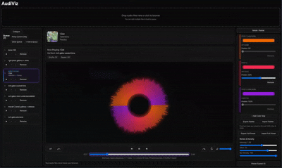

# AudiViz

A browser-based music visualizer built with React, Vite, Canvas, and the Web Audio API.

[](https://github.com/1gabeortiz/AudiViz/actions)

## Live Demo

- **Live app:** [AudiViz](https://audi-f33vlvhic-1gabeortizs-projects.vercel.app/)

If you only want to try AudiViz, use the live demo link above (no local setup required).


## Table of Contents

- [Features](#features)
- [Tech Stack](#tech-stack)
- [Privacy](#privacy)
- [Quick Start](#quick-start)
- [Keyboard Shortcuts](#keyboard-shortcuts)
- [Scripts](#scripts)
- [Deployment Notes](#deployment-notes)
- [Known Issue](#known-issue)

## Features

- Upload one or more audio files (click, drag/drop, and add-to-queue)
- Play music with custom controls and keyboard shortcuts
- Visualize audio in bars or radial mode
- Customize visuals (color mode, glow, density, motion)
- Save/load palette presets and full visualizer presets
- Manage playback queue (play now, reorder, remove, clear, keep current only)



## Tech Stack

- React
- Vite
- Web Audio API
- HTML Canvas
- ESLint + Vitest

## Privacy

Audio files are processed **locally in your browser** and are not uploaded by AudiViz.

## Quick Start

### Requirements

- Node.js (LTS recommended)
- npm

### Run locally

```bash
npm install
npm run dev
```

Open the localhost URL shown in your terminal.

## Keyboard Shortcuts

- `Space` -> play/pause
- `Left / Right` -> seek backward/forward
- `Up / Down` -> volume up/down
- `M` -> mute/unmute
- `P / N` -> previous/next track
- `S` -> shuffle toggle
- `R` -> repeat mode cycle

## Scripts

```bash
npm run dev        # start local dev server
npm run lint       # lint code
npm run test:run   # run tests once with coverage
npm run build      # production build
npm run preview    # preview production build locally
```

## Deployment Notes

- Recommended platform: **Vercel** (Vite preset)
- Build command: `npm run build`
- Output directory: `dist`
- Keep auto-deploy on `main` enabled
- Keep preview deploys enabled for pull requests

## Known Issue

- Radial visualizer can appear slightly low at some browser zoom levels.
- Bars mode is unaffected.
